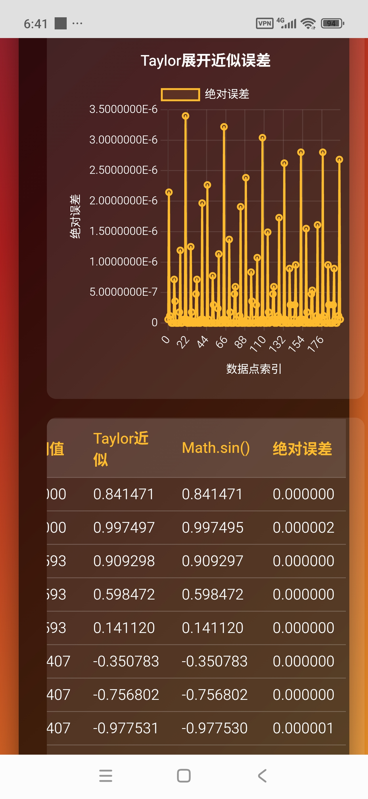
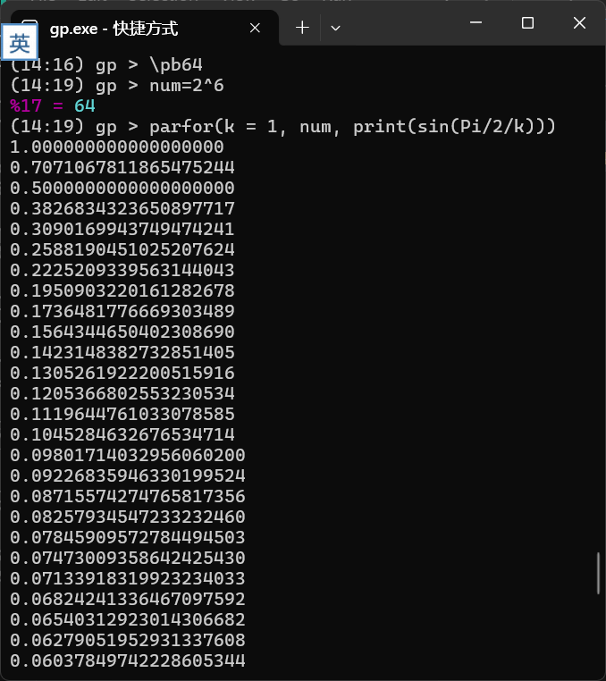

# sin-float-err
32位浮点计算sin(x)误差分析

[Sin函数Taylor展开误差可视化工具](https://2293.github.io/sin-float-err/)



### 并行计算sin(x)的值
```gp
\pb64 \\ set n significant digits / bits \p n, \pb n
num=2^10
parfor(k = 1, num, print(sin(Pi/2/k))) \\并行计算num个sin(x)的值
\quit
```
 `C:\Pari64-2-18-0\gp.exe -q compute_sin_x.gp > output1.txt`

 